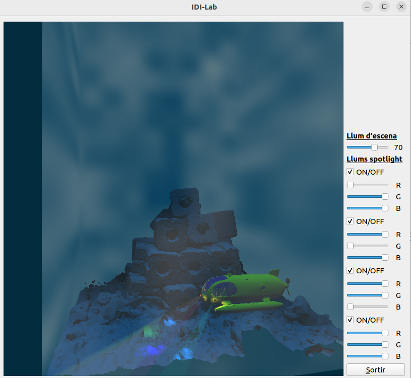
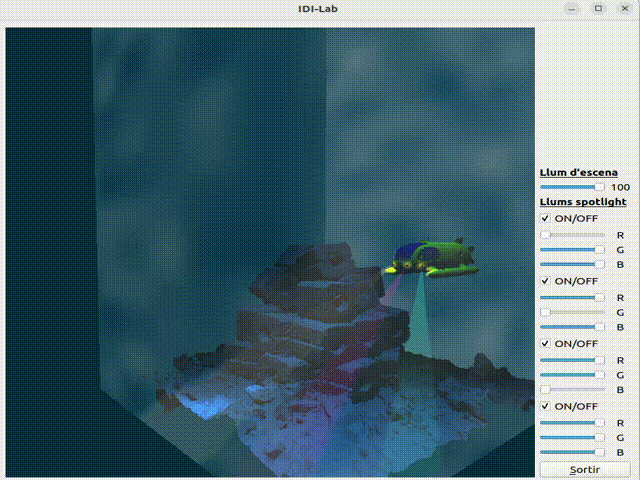

# INDI-Act3-2425Q2
An interactive 3D underwater scene using Qt and OpenGL 3.3, featuring dynamic lighting, submarine spotlights, and realistic water effects. Developed for the INDI course (EPSEVG - UPC, 2024–2025 Q2).

This project showcases real-time lighting with Phong shading, fog simulation based on distance, and spotlights represented both in 3D space and via 2D projections. User interface controls allow real-time adjustment of lighting parameters.

## 🚀 Features

- 💡 **Phong shading** with ambient, diffuse, and specular components.
- 🌊 **Water effect** using procedural 2D noise and semi-transparency.
- 🔦 **Submarine spotlights** with cone-based lighting logic and NDC beam visualization.
- 🌫 **Fog attenuation** based on camera distance for underwater realism.
- 🎛 **Qt GUI controls** for:
  - Toggling spotlights on/off
  - Adjusting spotlight colors
  - Modifying ambient light intensity

## 🎮 Controls

| Action                      | Input / Method              |
|-----------------------------|-----------------------------|
| Rotate scene view           | Left-click + Mouse drag     |
| Move submarine forward      | `W`                         |
| Move submarine backward     | `S`                         |
| Move submarine left         | `A`                         |
| Move submarine right        | `D`                         |
| Move submarine up           | `↑` (Arrow Up)              |
| Move submarine down         | `↓` (Arrow Down)            |
| Toggle spotlights           | GUI buttons                 |
| Change spotlight color      | GUI sliders                 |
| Adjust ambient light        | GUI sliders                 |

## 🧱 Project Structure

```
INDI-Act3-2425Q2/
├── Statement.pdf
├── Model/
│ ├── model.cpp
│ └── model.h
├── models/
│ ├── Submarine.obj
│ ├── Environment.obj
│ └── materials.mtl
├── shaders/
│ ├── phongShader.frag
│ └── phongShader.vert
├── MyGLWidget.cpp
├── MyGLWidget.h
├── BL2GLWidget.cpp
├── BL2GLWidget.h
├── main.cpp
├── MyForm.cpp
├── MyForm.h
├── MyForm.ui
├── Exercici-X.pro
├── README.md
└── media/
  ├── screenshot.png
  └── demo.gif
```

## 🖥 Requirements

- Qt 5 or higher  
- OpenGL 3.3+  
- CMake (or use Qt Creator for convenience)

## 📸 Screenshots





## 📘 Academic Context

Developed as part of:  
**INDI - Interacció i disseny d'interfícies**  
Degree: Computer Science  
University: Escola Politècnica Superior d'Enginyeria de Vilanova i la Geltrú (EPSEVG - UPC)  
Course term: **2024–2025 Q2**  
Mark: 9.88
